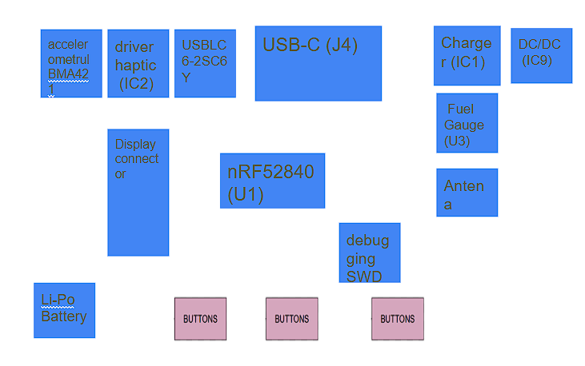

BOM

Reference | Qty | Value / Part | JLC Parts Link | Datasheet
U1 | 1 | nRF52840 | https://jlcpcb.com/parts/componentSearch?searchTxt=nRF52840 | https://infocenter.nordicsemi.com/pdf/nRF52840_PS_v1.1.pdf
IC1 | 1 | BQ25180YBGR | https://jlcpcb.com/parts/componentSearch?searchTxt=BQ25180YBGR | https://www.ti.com/lit/ds/symlink/bq25180.pdf
IC2 | 1 | DRV2605YZFR | https://jlcpcb.com/parts/componentSearch?searchTxt=DRV2605YZFR | https://www.ti.com/lit/ds/symlink/drv2605.pdf
IC3 | 1 | BMA421 | https://jlcpcb.com/parts/componentSearch?searchTxt=BMA421 | https://www.bosch-sensortec.com/media/boschsensortec/downloads/datasheets/bst-bma421-ds000.pdf
IC9 | 1 | RT6160AWSC | https://jlcpcb.com/parts/componentSearch?searchTxt=RT6160AWSC | https://www.richtek.com/assets/product_file/RT6160A/DS6160A-00.pdf
U3 | 1 | MAX17048G+T10 | https://jlcpcb.com/parts/componentSearch?searchTxt=MAX17048G+T10 | https://www.analog.com/media/en/technical-documentation/data-sheets/MAX17048-MAX17049.pdf
D3 | 1 | USBLC6-2SC6Y | https://jlcpcb.com/parts/componentSearch?searchTxt=USBLC6-2SC6Y | https://www.st.com/resource/en/datasheet/usblc6-2.pdf
Q1 | 1 | DMG2305UX-7 | https://jlcpcb.com/parts/componentSearch?searchTxt=DMG2305UX-7 | https://www.diodes.com/assets/Datasheets/DMG2305UX.pdf
Q3 | 1 | SI1308EDL-T1-GE3 | https://jlcpcb.com/parts/componentSearch?searchTxt=SI1308EDL | https://www.vishay.com/docs/63399/si1308edl.pdf
J1 | 1 | 503480-2400 | https://jlcpcb.com/parts/componentSearch?searchTxt=503480-2400 | https://www.molex.com/pdm_docs/sd/5034802400_sd.pdf
J2 | 1 | TC2030-IDC | https://jlcpcb.com/parts/componentSearch?searchTxt=TC2030-IDC | https://www.tag-connect.com/wp-content/uploads/bsk-pdf-manager/TC2030-IDC-NL.pdf
J4 | 1 | KH-TYPE-C-16P | https://jlcpcb.com/parts/componentSearch?searchTxt=KH-TYPE-C-16P | https://www.kinghelm.net/uploadfiles/file/20231201/KH-TYPE-C-16P.pdf
ANT1 | 1 | 2450AT18B100E | https://jlcpcb.com/parts/componentSearch?searchTxt=2450AT18B100E | https://www.kyocera-avx.com/docs/techinfo/2450AT18B100.pdf
L7 | 1 | FTC252012SR47MBCA | https://jlcpcb.com/parts/componentSearch?searchTxt=FTC252012SR47MBCA | https://www.fenghua-advanced.com/upload/FTC252012.pdf
SW_DN,SW_ENT,SW_UP | 3 | EVP-AKE31A | https://jlcpcb.com/parts/componentSearch?searchTxt=EVP-AKE31A | https://industrial.panasonic.com/cdbs/www-data/pdf/ABH0000/ABH0000CE116.pdf
X1 | 1 | 32MHz Crystal | https://jlcpcb.com/parts/componentSearch?searchTxt=32MHz crystal 2016 | https://ecsxtal.com/store/pdf/ECS-2016MV.pdf
X2 | 1 | 32.768kHz Crystal | https://jlcpcb.com/parts/componentSearch?searchTxt=32.768kHz crystal 3215 | https://abracon.com/Resonators/ABS07.pdf
C* | multiple | Capacitors 0201/0402 | https://jlcpcb.com/parts/componentSearch?searchTxt=capacitor 0402 | https://www.murata.com/products/productdata/8796745949214/mlcc02e.pdf
R* | multiple | Resistors 0201 | https://jlcpcb.com/parts/componentSearch?searchTxt=resistor 0201 | https://www.yageo.com/upload/media/product/productsearch/datasheet/rchip/PYu-RC_Group_51_RoHS_L_12.pdf
L1,L2,L3,L5 | multiple | Inductors SMD | https://jlcpcb.com/parts/componentSearch?searchTxt=smd inductor | https://www.murata.com/products/productdata/8797098139678/ENFA0008.pdf
TP* | 14 | Test Pads | https://jlcpcb.com/parts/componentSearch?searchTxt=test pad pcb | https://www.keystone-europe.com/downloads/datasheets/5000.pdf

FUNCTIONALITATE

Proiectul este o platformă embedded portabilă bazată pe microcontroller-ul nRF52840, proiectată pentru aplicații low-power cu interfață vizuală E-Paper, alimentare din baterie Li-Po, conectivitate USB-C, feedback haptic și senzori de mișcare. Toate componentele sunt montate pe stratul Top al plăcii PCB.

Microcontroller-ul principal este nRF52840. Acesta integrează procesor ARM Cortex-M4F la 64 MHz, memorie Flash 1 MB, RAM 256 KB și transceiver radio 2.4 GHz compatibil Bluetooth Low Energy. Comunicarea RF se realizează printr-o antenă ceramică 2.45 GHz conectată printr-o rețea de adaptare de impedanță formată din L1, C3, C4 și pad opțional C22 pentru tuning RF. Oscilatorul principal extern este de 32 MHz (X1), iar oscilatorul low-power RTC este de 32.768 kHz (X2).

Interfața USB este realizată prin conector USB Type-C J4. Liniile D+ și D- sunt conectate direct la microcontroller pentru comunicație USB Full Speed. Pinii CC1 și CC2 sunt configurați prin rezistențe de 5.1 kΩ la masă pentru mod Device. Protecția ESD a liniilor USB este realizată de componenta USBLC6-2SC6Y.

Alimentarea principală provine din baterie Li-Po reîncărcabilă. Circuitul de încărcare este BQ25180YBGR, care gestionează încărcarea de la VBUS (5 V USB), controlul curentului de încărcare și monitorizarea stării prin interfață I2C. Tensiunea bateriei este disponibilă pe net-ul BAT și filtrată local prin condensatorul C39.

Conversia de tensiune este realizată de RT6160AWSC, convertor buck-boost controlat prin I2C. Acesta poate ridica sau coborî tensiunea bateriei pentru a genera rail-ul stabilizat necesar sistemului. Etajul de putere utilizează inductanța L7 și condensatorii C23, C24 la intrare respectiv C25, C32 la ieșire.

Monitorizarea nivelului bateriei este realizată de MAX17048G+T10, fuel gauge conectat la magistrala I2C. Acesta măsoară tensiunea celulei și estimează procentul de încărcare, oferind semnal ALERT către microcontroller.

Senzorul de mișcare utilizat este BMA421, accelerometru triaxial low-power. Comunicarea cu microcontroller-ul se face prin I2C, iar liniile INT1 și INT2 permit detectarea de evenimente precum mișcare, tap sau wake-up. Alimentarea senzorului este filtrată prin C18 și C19.

Feedback-ul tactil este realizat prin DRV2605YZFR, driver dedicat pentru motoare ERM/LRA. Acesta este controlat prin I2C și poate genera modele de vibrație prestabilite. Ieșirile OUT+ și OUT- sunt rutate către test point-urile TP_OP și TP_ON.

Interfața vizuală este un display E-Paper conectat prin conector FPC J1 cu 24 pini. Controlul se face de la microcontroller prin semnale dedicate (SPI și GPIO), inclusiv EPD_CS. Circuitul auxiliar al display-ului folosește MOSFET-ul Q3 și componente pasive dedicate pentru generarea tensiunilor necesare panoului.

Interfața utilizator este compusă din trei butoane tactile SW_UP, SW_ENT și SW_DN, conectate la GPIO-urile microcontroller-ului. Acestea permit navigare în meniu și control local fără dispozitive externe.

Programarea și depanarea hardware se realizează prin conectorul J2 compatibil SWD. Sunt disponibile liniile SWDIO, SWDCLK, RESET și SWO. În plus, placa include multiple test point-uri pentru 3.3V, GND, VBAT, SDA, SCL și alte semnale utile în validare.

Magistrala principală de comunicație internă este I2C, partajată între charger, convertorul DC/DC, fuel gauge, IMU și driverul haptic. Aceasta reduce numărul de pini utilizați și simplifică layout-ul PCB.

Estimarea consumului de energie depinde de modul de operare. nRF52840 în sleep poate coborî la ordinul microamperilor. În transmisie radio consumul este de ordinul miliamperilor. Display-ul E-Paper consumă aproape zero în regim static și energie doar la refresh. IMU-ul BMA421 funcționează în mod low-power la câțiva microamperi. Driverul haptic consumă semnificativ doar în timpul vibrației. Autonomia sistemului este favorizată de utilizarea componentelor low-power și a afișajului bistabil.

PCB-ul este proiectat pe 4 straturi, cu planuri dedicate de masă pentru integritate de semnal, zgomot redus și performanță RF mai bună. Toate componentele sunt plasate pe stratul superior pentru asamblare simplificată SMT.

PINI

nRF52840 este microcontroller-ul principal al sistemului și controlează toate perifericele hardware: alimentare, senzori, display, comunicație USB și debugging. Alegerea pinilor a fost făcută pentru a folosi interfețele hardware dedicate și pentru a simplifica rutarea PCB.

Pinii D+ și D- sunt conectați la conectorul USB-C prin protecția ESD D3. Aceștia sunt utilizați pentru comunicație USB nativă, programare și transfer de date.

Pinii SWDIO, SWDCLK, RESET și SWO sunt scoși la conectorul J2 pentru programare și debugging hardware.

P0.07 și P0.08 sunt utilizați ca SDA și SCL pentru magistrala I2C. Pe această magistrală sunt conectate BQ25180 (charger), RT6160A (buck-boost), MAX17048 (fuel gauge), BMA421 (IMU) și DRV2605 (driver haptic). Alegerea I2C reduce numărul de pini utilizați.

P1.08 și P1.09 sunt conectați la INT1 și INT2 de la accelerometru, pentru wake-up la mișcare și notificări hardware.

P0.11 este utilizat pentru semnal de interrupt din zona de power management.

P0.12 este utilizat pentru controlul subsistemului haptic.

P0.06 este utilizat pentru EPD_CS, semnal de selecție al display-ului E-Paper. Restul pinilor display-ului folosesc SPI și GPIO pentru control.

P0.04 și P0.05 sunt pini analogici utilizați pentru măsurători ADC, de exemplu monitorizare tensiune.

Pinul ANT este conectat la rețeaua RF L1, C3, C4 și antena ceramică. Traseul este menținut scurt pentru performanță radio bună.

XC1 și XC2 sunt conectați la cristalul de 32 MHz, iar XL1 și XL2 la cristalul de 32.768 kHz pentru RTC low-power.

PCB-ul este pe 4 straturi, cu plane de masă dedicate și toate componentele pe Top Layer. Antena este plasată la marginea plăcii cu keepout RF. Zona de alimentare este separată de zona RF, iar test point-urile pentru 3.3V, GND, VBAT, SWD și I2C permit depanare rapidă. Designul este optimizat pentru consum redus și funcționare pe baterie.

